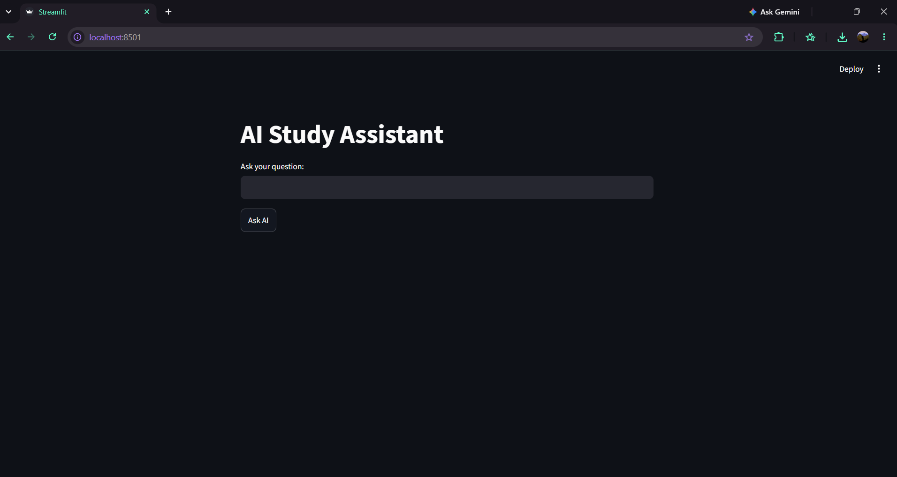

# AI Study Assistant

A simple local AI question-answering application built using Python, Streamlit, and Ollama with the Llama 3.2 model.

## Project Overview

The AI Study Assistant allows users to enter questions through a simple Streamlit web interface. The question is sent to the locally running Llama 3.2 model through Ollama, and the generated response is displayed on the webpage.

## Features

- Simple interactive web interface
- Ask questions using a text input
- AI-generated responses
- Runs a local Llama 3.2 model through Ollama
- Built using Python and Streamlit

## Technologies Used

- Python
- Streamlit
- Ollama
- Llama 3.2
- VS Code

## How It Works

1. The user enters a question in the Streamlit interface.
2. The application sends the question to Ollama.
3. Ollama communicates with the locally available Llama 3.2 model.
4. The generated response is returned to the application.
5. Streamlit displays the response to the user.

## Example Questions

The application can be tested with questions such as:

- What is artificial intelligence?
- Explain machine learning in simple words.
- What is a neural network?
- Explain Python to a beginner.
- What is the difference between AI and machine learning?
## Screenshots

### Main Interface

### Neural Network Response

### Python Response

## Installation
cd ollama-streamlit-ai-study-assistant
3. Install Python dependencies
pip install -r requirements.txt
4. Make sure Ollama and Llama 3.2 are available
The application requires Ollama to be installed and the Llama 3.2 model to be available locally.
## Project Structure
ollama-streamlit-ai-study-assistant/
│
├── app.py
├── requirements.txt
├── README.md
├── .gitignore
│
├── screenshots/
│   ├── home.png
│   ├── neural-network.png
│   └── python-response.png
│
└── report/
    └── Minor_Project_5_Report.pdf
## Learning Outcomes
Through this project, I learned how to:
Run a local AI model using Ollama
Connect Python with a local language model
Build an interactive interface using Streamlit
Send user prompts to an AI model
Display AI-generated responses in a web application
## Project Report
The project report is available in the report folder.
## Author
Modewar Thashan Sai
Minor Project — AI Study Assistant
## License
This project is created for educational purposes.
